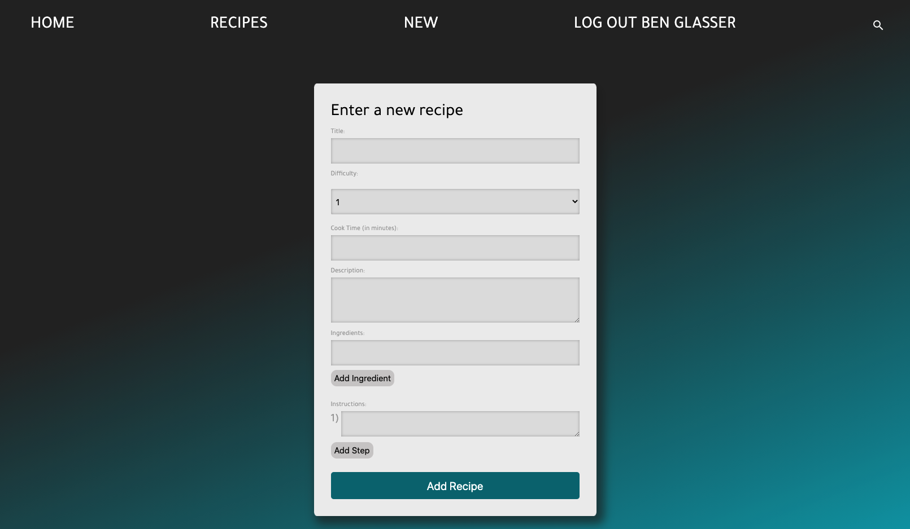

# Recipeasy

Recipeasy puts the <em>ease</em> in Recip<em>ese</em>. add your favorite recipes to the app and share with your friends!

## Screenshots

## Technologies
- HTML5
- CSS3
- Javascript
- JQuery
- Express
- Node.JS

## Getting Started
[Click here](http://recipeasy4sheasy.herokuapp.com/) to get started

## Future Enhancements
1. Shopping list feature
2. Add random items as well as items from recipes
3. add a reviews and comment section